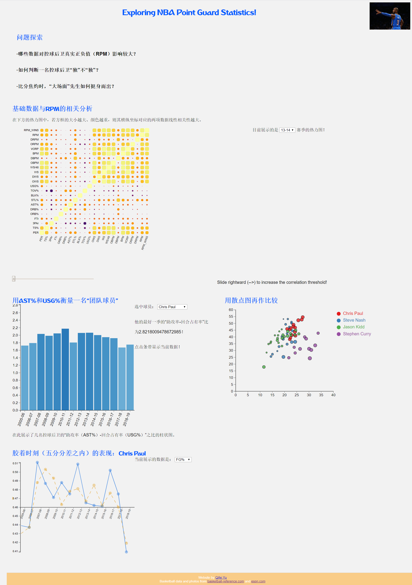

# NBA Point Guard Statistic Analysis & Visualization

A free design project.

## Visualization design

Completed Task list here:

- **Info Panel** list questions.

- **Heat Map** for NBA basic and advanced stat correlation analysis.

- **Bar Chart** for displaying point guards `AST% / USG%` in time series.

- **Scatter Plot** for compare `AST% / USG%` along with `TOV%` between these top point guards.

- **Multi-Line Plot** for measure shooting performance in margin less than or equal to five points, compared to that of per game performance in the same season.

## Implementation

My project structure looks like this:

    VisNBA/
        index.html
        script.js
        styles.css
        data/
        	fifa-world-cup.csv
        	ast%-usg%/
        			 cpaul.csv
        			 jkidd.csv
        			 scurry.csv
        			 snash.csv
		 	pg_per-100-poss/corrMatrix/
		 	                          corrMatrix_reshape_14.csv
		 	                          corrMatrix_reshape_15.csv
		 	                          corrMatrix_reshape_16.csv
		 	                          corrMatrix_reshape_17.csv
		 	                          corrMatrix_reshape_18.csv
		 	                          corrMatrix_reshape_19.csv
            player_per-game/
            			   cpaul.csv
		    shooting-margin-value-5pts/
		                              cpaul.csv
            data-mining.py
            scrap-table.py
        assets/
        	# various assets
        figs/
        	# figures / videos used in the description
        	# other relevant for the project

Remember, to be able to access the data files with javascript, you will need to be *serving* the VisNBA directory, not just opening the HTML file in a browser. If your development environment doesn't already launch a server for you, you can start one with:

    cd path/to/source
    # python 2
    python -m SimpleHTTPServer
    # python 3
    python -m http.server

And you can view the page at [http://localhost:8000](http://localhost:8000)

## About the data

The data is retrieved from [basketball-reference](https://www.basketball-reference.com/) and [ESPN](espn.com/nba/statistics/rpm).

## DONE!

Final visualization:

